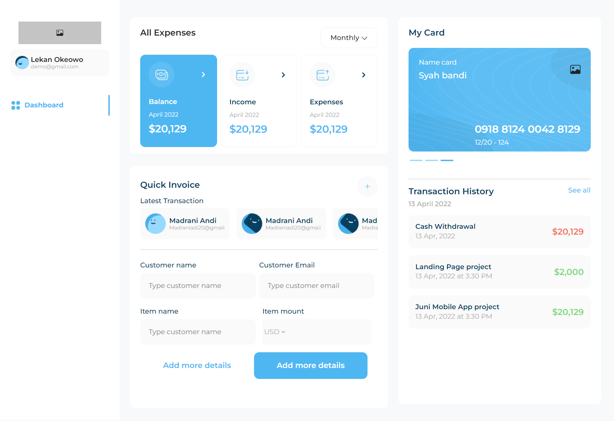

# Website Banking
Banking is a bank application design that shows various information about customers and various features in a current bank application. 

## Instal
Banking website can run locally on your machine. Please download this repository and open it using Visual Studio Code. Then, execute the following commands in the terminal.
```sh
cd Banking
```
```sh
npm i
```
```sh
npm start
```
## Tech
- [Bootstrap](https://getbootstrap.com/) - A CSS framework is a collection of HTML, CSS, and JavaScript templates that enable the rapid and easy creation of responsive websites.
- [HTML] - Hypertext Markup Language (HTML) is the standard markup language for creating and structuring web pages and applications.
- [CSS] - Cascading Style Sheets (CSS) is used to control the appearance of elements written in the markup language.
- [Google Chrome](https://www.google.com/chrome) - Google Chrome is a software that functions to search, access, and display various forms of information.
- [JavaScript] - Programming languages used in website development to make them more dynamic and interactive.
- [React Icons](https://react-icons.github.io/react-icons/) - provide popular icons for React project creators easily with react-icons, which uses ES6 imports .
- [React JS](https://legacy.reactjs.org/) -  JavaScript library used in the development process of dynamic web applications.
## Screenshots
<table>
 <tr>
    <td></td>
  </tr>
</table>

## Related Project

- [`Linkedin`](https://www.linkedin.com/in/muhammad-sony-setiawan/)

- [`Demo Banking`](https://banking-ruby-iota.vercel.app/)
